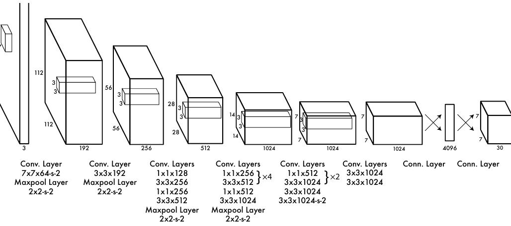
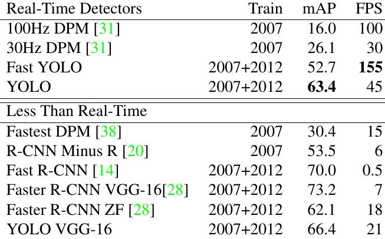

# Multi-Model RAG App

aims to extract any type of data such as ( images, Tables, Texts).

## Libs

- **unstructured** :: This is very amazing library so by using this library you can extract any type of data.

    * It will make you dispense with OCR or object detection and object segmentation to extract text from docs.
    
            pip install unstructured

- **pillow** :: Is a powerful and easy-to-use image processing.

- **pydantic** :: Is a data validation and settings management library.

    * We Used it when wanting to do a structure on which the model runs it.

- **lxml** :: Used for processing XML and HTML documents.

- **matplotlib** :: Used for generating plots, histograms, bar charts, scatter plots, and more. 

    * Fundamental tool for data visualization in Python.

- **poppler-utils** :: Used for dealing images in pdfs. 

- **tesseract-ocr** ::  It is widely used for converting images of text into machine-encoded text.

- **tesseract-ocr** ::  It is widely used for converting images of text into machine-encoded text.


## Steps Of Project.

#### 1) Knowledge Base :

- collect sources from different documents ( **Types of data** ).

#### 2) Split pdf to Partitions :

- image, csv file, tables .........

#### 3) Get a partition :

- through the link : https://github.com/Unstructured-IO/unstructured/tree/main/unstructured/partition

#### 1) CSV file

```python
def partition_csv(
    filename: Optional[str] = None,
    file: Optional[IO[bytes]] = None,
    metadata_filename: Optional[str] = None,
    metadata_last_modified: Optional[str] = None,
    include_header: bool = False,
    include_metadata: bool = True,
    infer_table_structure: bool = True,
    languages: Optional[list[str]] = ["auto"],
    date_from_file_object: bool = False,
    **kwargs: Any,
) 
```

#### 2) DOC file

```python
def partition_doc(
    filename: Optional[str] = None,
    file: Optional[IO[bytes]] = None,
    include_page_breaks: bool = True,
    include_metadata: bool = True,
    metadata_filename: Optional[str] = None,
    metadata_last_modified: Optional[str] = None,
    libre_office_filter: Optional[str] = "MS Word 2007 XML",
    chunking_strategy: Optional[str] = None,
    languages: Optional[list[str]] = ["auto"],
    detect_language_per_element: bool = False,
    date_from_file_object: bool = False,
    starting_page_number: int = 1,
    strategy: Optional[str] = None,
    **kwargs: Any,
)
```

#### 3) Image file

```python
def partition_image(
    filename: Optional[str] = None,
    file: Optional[IO[bytes]] = None,
    include_page_breaks: bool = False,
    infer_table_structure: bool = False,
    ocr_languages: Optional[str] = None,
    languages: Optional[list[str]] = None,
    strategy: str = PartitionStrategy.HI_RES,
    metadata_last_modified: Optional[str] = None,
    chunking_strategy: Optional[str] = None,
    hi_res_model_name: Optional[str] = None,
    extract_images_in_pdf: bool = False,
    extract_image_block_types: Optional[list[str]] = None,
    extract_image_block_output_dir: Optional[str] = None,
    extract_image_block_to_payload: bool = False,
    date_from_file_object: bool = False,
    starting_page_number: int = 1,
    extract_forms: bool = False,
    form_extraction_skip_tables: bool = True,
    **kwargs: Any,
)
```

#### 4) JSON file

```python
def partition_json(
    filename: Optional[str] = None,
    file: Optional[IO[bytes]] = None,
    text: Optional[str] = None,
    include_metadata: bool = True,
    metadata_filename: Optional[str] = None,
    metadata_last_modified: Optional[str] = None,
    date_from_file_object: bool = False,
    **kwargs: Any,
)
```


#### 5) Text file

```python
def partition_text(
    filename: Optional[str] = None,
    file: Optional[IO[bytes]] = None,
    text: Optional[str] = None,
    encoding: Optional[str] = None,
    paragraph_grouper: Optional[Callable[[str], str]] | Literal[False] = None,
    metadata_filename: Optional[str] = None,
    include_metadata: bool = True,
    languages: Optional[list[str]] = ["auto"],
    max_partition: Optional[int] = 1500,
    min_partition: Optional[int] = 0,
    metadata_last_modified: Optional[str] = None,
    chunking_strategy: Optional[str] = None,
    detect_language_per_element: bool = False,
    detection_origin: Optional[str] = "text",
    date_from_file_object: bool = False,
    **kwargs: Any,
) 
```


## Knowledges about this project

- helping to understand the project.

#### 1) Types of data :

- Structured data ----> Numeric data ----> [CSV, TSV, XLXS] Files.
- Semi-structured data ----> [JSON, XML, HTML, YAML] Formats.
- Unstructured data ----> Text, Image and Video.


## Results

#### imge



#### Table

